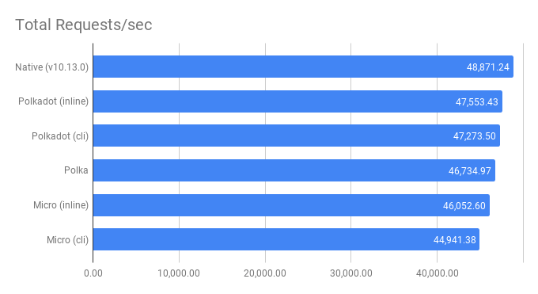
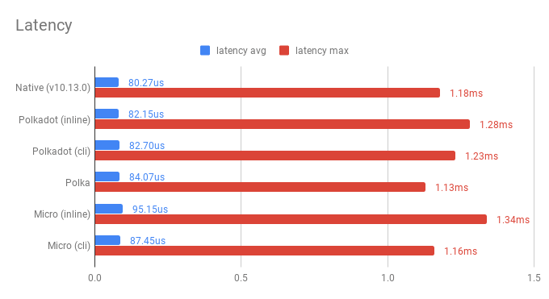

## Benchmarks

> Running Node v10.13.0

We use [`wrk`](https://github.com/wg/wrk) for running benchmarks. Results are taken after one warm-up run.

```sh
$ wrk -t4 -c4 -d10s http://localhost:3000
```

These are the versions used for each candidate:

* Micro: 9.3.3
* Node: 10.13.0
* Polkadot: 1.0.0
* Polka: 0.5.2

## Graphs

> Check out the [raw data](#results) below~!

<p align="center">
  
  
</p>


## Results

These are the `wrk` results used to plot the charts above.

```
Native
    Running 10s test @ http://localhost:3000
      4 threads and 4 connections
      Thread Stats   Avg      Stdev     Max   +/- Stdev
        Latency    80.27us   35.85us   1.18ms   84.16%
        Req/Sec    12.28k     2.72k   16.80k    57.67%
      493560 requests in 10.10s, 48.95MB read
    Requests/sec:  48871.24
    Transfer/sec:      4.85MB


Polkadot (inline)
    Running 10s test @ http://localhost:3000
      4 threads and 4 connections
      Thread Stats   Avg      Stdev     Max   +/- Stdev
        Latency    82.15us   25.83us   1.28ms   86.92%
        Req/Sec    11.95k   379.95    13.24k    70.05%
      480269 requests in 10.10s, 47.63MB read
    Requests/sec:  47553.43
    Transfer/sec:      4.72MB


Polkadot (cli)
    Running 10s test @ http://localhost:3000
      4 threads and 4 connections
      Thread Stats   Avg      Stdev     Max   +/- Stdev
        Latency    82.70us   26.37us   1.23ms   87.74%
        Req/Sec    11.88k   434.01    13.09k    75.25%
      477440 requests in 10.10s, 47.35MB read
    Requests/sec:  47273.50
    Transfer/sec:      4.69MB


Polka
    Running 10s test @ http://localhost:3000
      4 threads and 4 connections
      Thread Stats   Avg      Stdev     Max   +/- Stdev
        Latency    84.07us   37.11us   1.13ms   82.40%
        Req/Sec    11.74k     2.78k   16.00k    52.72%
      472020 requests in 10.10s, 46.82MB read
    Requests/sec:  46734.97
    Transfer/sec:      4.64MB


Micro (inline)
    Running 10s test @ http://localhost:3000
      4 threads and 4 connections
      Thread Stats   Avg      Stdev     Max   +/- Stdev
        Latency    85.15us   38.07us   1.34ms   84.05%
        Req/Sec    11.60k     2.84k   16.29k    53.35%
      465090 requests in 10.10s, 46.13MB read
    Requests/sec:  46052.60
    Transfer/sec:      4.57MB


Micro (cli)
    Running 10s test @ http://localhost:3000
      4 threads and 4 connections
      Thread Stats   Avg      Stdev     Max   +/- Stdev
        Latency    87.45us   38.30us   1.16ms   83.29%
        Req/Sec    11.29k     2.95k   15.55k    44.55%
      453906 requests in 10.10s, 45.02MB read
    Requests/sec:  44941.38
    Transfer/sec:      4.46MB
```
